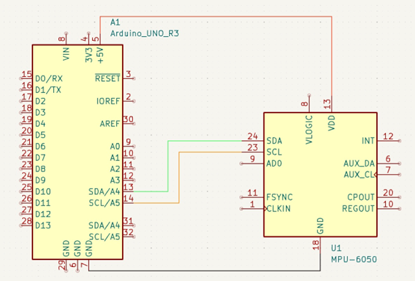

# Motion Tracking with MPU6050 and Blender

This project integrates an MPU6050 sensor with Arduino to perform real-time motion tracking visualized in Blender.

## Project Overview
- Arduino reads gyroscope and accelerometer data from MPU6050.
- Complementary filter applied to stabilize angles (roll, pitch, yaw).
- Data sent via serial communication to Blender.
- Blender reads serial data using Python, updating the 3D model orientation in real-time.

## Hardware Components
- Arduino UNO
- MPU6050 Gyroscope and Accelerometer Sensor
- Jumper wires and breadboard

## Quick Start
### Arduino
1. Upload `offset_calibration.ino` first to calibrate sensor offsets.
2. Upload `imu_sensor.ino` for regular operation.

### Blender
1. Open `rotation.blend`.
2. Ensure `serial_reader.py` is linked or run directly in Blender’s scripting environment.
3. Run the Blender script to begin real-time tracking.

## Documentation & Diagrams
- Detailed explanation in [motion_tracking_documentation.md](docs/motion_tracking_documentation.md)
- Wiring diagram: 

## Results and Improvements
- Effective real-time tracking with minor (~5ms) delay.
- Future enhancements include more accurate filtering (e.g., Kalman filter).

## Contributions
Contributions or improvements are welcome. Fork and submit pull requests!
