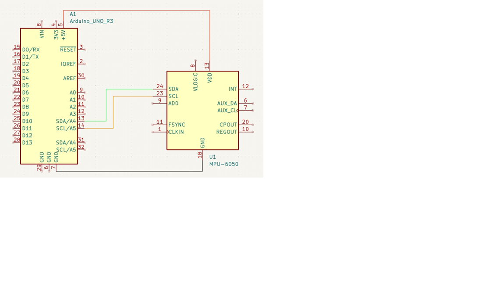

# Motion Tracking Project Documentation

## Introduction
This project integrates an MPU6050 motion sensor with an Arduino UNO and visualizes motion data in Blender. The goal is to track and represent real-time motion in a 3D environment.

---

## Hardware Setup

### Components Used:
- Arduino UNO
- MPU6050 Gyroscope and Accelerometer Sensor
- Connecting Wires

### Connections:
| MPU6050 Pin | Arduino UNO Pin |
|-------------|-----------------|
| VDD         | 5V              |
| GND         | GND             |
| SDA         | A4              |
| SCL         | A5              |

**Wiring diagram:**

---

## Software Implementation

### Arduino Code
- Utilizes `Wire.h` and `MPU6050.h` libraries.
- Initializes the sensor and applies calibration offsets.
- Reads gyroscope and accelerometer data to compute roll, pitch, and yaw angles.
- Implements a complementary filter to enhance stability.
- Sends processed motion data via serial communication to the computer.

### Blender Integration
- A Python script in Blender reads serial data from the Arduino.
- Uses the `bpy` module to update object rotation in real-time.
- Implements a separate thread for reading serial data without blocking Blender's UI.
- Registers a timer function to periodically update object orientation based on incoming sensor data.

---

## Results and Observations
- Real-time tracking effectively translates sensor movements into 3D rotations.
- Complementary filtering reduces noise and improves angle accuracy.
- A minor delay (~5ms) is introduced to maintain smooth updates.
- Potential improvements include fine-tuning calibration and adding magnetometer support for better yaw stability.

---

## Conclusion
This setup successfully achieves real-time motion tracking and visualization. Future enhancements may include refining data smoothing techniques and exploring more advanced filtering algorithms, such as Kalman filtering, to improve accuracy.

